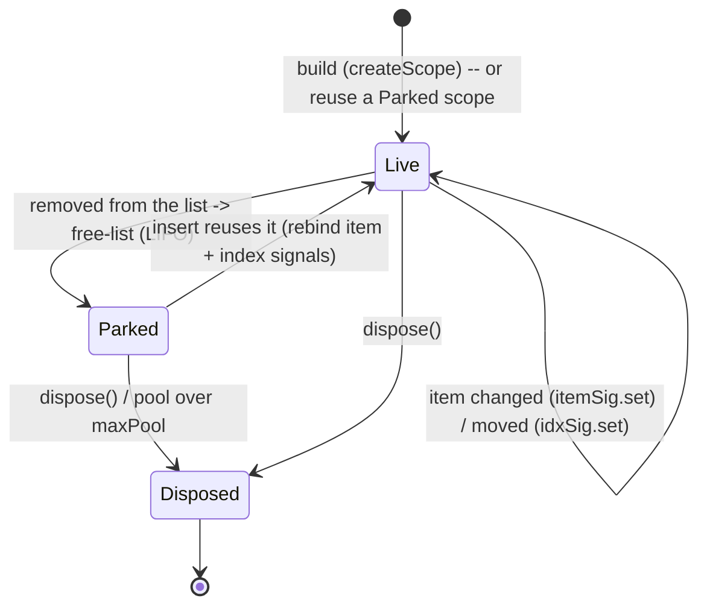

# @zakkster/lite-map

[](https://www.npmjs.com/package/@zakkster/lite-map)

[](https://github.com/sponsors/PeshoVurtoleta)
[](https://bundlephobia.com/result?p=@zakkster/lite-map)
[](https://www.npmjs.com/package/@zakkster/lite-map)
[](https://www.npmjs.com/package/@zakkster/lite-map)
[](https://github.com/PeshoVurtoleta/lite-signal)


[](https://opensource.org/licenses/MIT)

**Zero-GC keyed list reconciliation for [`@zakkster/lite-signal`](https://www.npmjs.com/package/@zakkster/lite-signal).**

Map a reactive array to one reactive scope per item. When the list mutates,
lite-map **moves and rebinds** the existing scopes instead of rebuilding them, and
only the items that actually changed recompute.

The thing that sets it apart from Solid's `mapArray`: removed items' scopes are not
thrown away. They go to a **free-list** and are **reused** by later inserts. So the
realistic shape of a live list -- a few rows in, a few out, a reorder -- pulls
nothing from the lite-signal pool and never grows it.

DOM-free. The mapped output is whatever your `mapFn` returns: a DOM node, a derived
value, a sub-view. A `<For>` is one consumer of the `() => O[]` accessor, not the
primitive itself.

```
npm install @zakkster/lite-map
```

> **Peer dependency:** `@zakkster/lite-signal` `^1.6.0-preview.0`. lite-map is built
> on `createScope` -- the detached per-item-subtree disposal primitive introduced in
> `1.6.0-preview.0`. ESM only. MIT.

---

## The idea

A naive `array -> views` mapping rebuilds every view when the array changes. That
allocates, runs every item's setup again, and (for DOM) churns nodes. lite-map keeps
a scope per item and reconciles:

- **value changed, position same** -> set one signal, the item's own effects re-run.
- **item moved** -> set its index signal, only index-dependent bindings re-run.
- **item removed** -> its scope is **parked** on a free-list.
- **item inserted** -> a **parked** scope is **rebound** to the new item (no rebuild),
  or one is built if the pool is empty.

Two primitives, differing in what they key on. Both pass the **changing** dimension
as an accessor -- that is precisely what lets a parked scope be reused by setting a
signal rather than re-running `mapFn`.

---

## `indexArray` -- position-keyed

`item` is an accessor (the value at this slot can change); `index` is a plain number
(the slot itself is stable). For fixed-shape lists whose **contents** change: a grid,
a fixed set of rows, a ring of samples.

```js
import { indexArray } from "@zakkster/lite-map";
import { signal, effect } from "@zakkster/lite-signal";

const prices = signal([100, 200, 300]);

const cells = indexArray(prices, (price, i) => {
    const el = document.createElement("div");
    effect(() => { el.textContent = `#${i}: ${price()}`; });   // re-runs only when THIS slot's value changes
    return el;
});

// later: same length, new values -> three signal sets, zero scopes rebuilt
prices.set([110, 200, 333]);
```

Value churn at a stable length is pure signal-set -- **zero-GC**. Growing appends new
slots; shrinking parks tail slots on a free-pool, and growing back reuses them
(push/pop at the tail is zero-GC).

---

## `mapArray` -- item-keyed

**Both** `item` and `index` are accessors. Items keep their identity across a reorder
(their reactive index updates to the new position), and a retired scope can be reused
for a brand-new item. For lists where rows are **identities** that move, come, and go:
a todo list, a feed, a sortable table.

```js
import { mapArray } from "@zakkster/lite-map";
import { signal, effect } from "@zakkster/lite-signal";

const todos = signal([
    { id: 1, text: "buy milk" },
    { id: 2, text: "walk dog" },
]);

const rows = mapArray(
    todos,
    (todo, index) => {
        const li = document.createElement("li");
        effect(() => { li.textContent = `${index() + 1}. ${todo().text}`; });
        return li;
    },
    { key: (t) => t.id },   // default is reference identity; here we key by id
);

// reorder: both rows survive, their index accessors update -> no rebuild
todos.set([{ id: 2, text: "walk dog" }, { id: 1, text: "buy milk" }]);

// remove id:1, then insert id:3 -> id:1's scope is parked, then reused for id:3
todos.set([{ id: 2, text: "walk dog" }]);
todos.set([{ id: 2, text: "walk dog" }, { id: 3, text: "pay rent" }]);
```

Keys must be unique within the list: only the first occurrence of a key is addressable,
so a duplicate gets a scope of its own but is never reachable by key. Since 1.1 a duplicate
is *contained* -- it cannot evict the entry of the row that legitimately owns that key, so a
transient duplicate (an overlapping page, a fanned-out join) can no longer cost a unique key
its identity once the list is unique again. `maxPool` caps how many retired scopes are kept
for reuse (default: unbounded).

---

## Scope lifecycle

Each item's scope moves through these states. Parking and reuse are what keep churn
off the allocator.



The **build** and **dispose** edges are the only ones that touch the pool. Steady-state
list editing rides the **Live <-> Parked** loop, which sets signals and rebinds -- no
allocation, no pool growth.

---

## Output and ownership

`mapped()` returns the current outputs in source order. It is **one persistent array,
mutated in place** -- read it fresh on each reactive run; do not retain it or compare
it by reference. It fires only on a real structural change (membership or order), not
on value-only churn (those flow through each item's own effects).

```js
effect(() => {
    parent.replaceChildren(...rows());   // re-runs when rows are added/removed/reordered
});
```

Each item owns a `createScope` scope: its `mapFn` effects and computeds are cascaded
on disposal. **Per-item scopes and the reconcile driver are detached from the calling
scope** -- an enclosing effect re-running will never tear your list down. In exchange,
the caller owns teardown:

```js
rows.dispose();   // stop the driver, dispose every live + parked scope
```

There is no auto-cleanup. Call `dispose()` when the list is no longer needed (a `<For>`
wrapper does this on unmount).

---

## Zero-GC -- and the honest non-claims

Measured against the engine's pool counters (`poolGrowths` / `totalAllocations`),
**flat after warm-up**:

| Operation | Pool behavior |
| --- | --- |
| `indexArray` value churn, stable length | flat (20k updates, verified) |
| `mapArray` reorder / move | flat -- `idxSig.set` on shifted survivors |
| `mapArray` insert/remove, warm pool | flat (5k iters, verified) -- reuse a parked scope |
| `indexArray` tail grow/shrink | flat -- serviced by the free-pool |

**Not claimed:**

- **Growth past the previous high-water mark** pulls scopes from the pool -- there is
  no representing N+1 distinct items with N scopes. Warm to your peak.
- The keyed `byKey` Map mutates (`set`/`delete`) on **actual key changes** -- a JS-heap
  allocation the pool counters do not see. A reorder touches no key, so it does not
  churn the Map; inserts/removes touch one key each.
- Your `mapFn` body. If it allocates per re-run, that allocation is yours.

A note on `createScope`: it cascades effects and computeds but **not signals** (the
engine never owner-adopts signals). lite-map disposes the item/index signals it
creates. A **bare signal you create inside `mapFn`** is not auto-disposed on scope
teardown -- prefer effects/computeds (which are cascaded), or dispose it yourself.

---

## API

```ts
indexArray(list, (item: () => T, index: number) => O, opts?: { maxPool?: number }): Mapped<O>
mapArray(list, (item: () => T, index: () => number) => O, opts?: { key?: (item: T) => unknown; maxPool?: number }): Mapped<O>
createMapper(registry): { mapArray, indexArray }    // bind to a non-default registry
```

`list` is an accessor (`() => T[]`); a lite-signal handle is callable and satisfies it.
`Mapped<O>` is `(() => O[]) & { dispose(): void }`.

---

## Not in 1.0 (deferred)

- **by-value `mapArray`** -- `item` as a plain value (Solid-style ergonomics). It
  cannot reuse a parked scope for a new item without re-running `mapFn`, so its
  inserts pull from the pool; it will ship as an opt-in, with the by-accessor mode
  (this release) remaining the zero-GC default.
- **LIS minimal-move ordering** -- 1.0 reorders are correct but not minimal (more
  index updates than the theoretical floor). A longest-increasing-subsequence pass to
  minimize moves is planned.

---

## Tail fast-paths (1.1)

`mapArray` now classifies the dominant real-world mutations -- **append**, **pop**,
and **in-place value churn** (feeds, logs, push/pop) -- with a position-aligned
common-prefix scan by key, *before* the general keyed diff. When the whole prefix
is intact, the general path (its per-item `byKey.get`, scratch swap and full retire
scan) is skipped: the only structural work is O(delta) at the tail, and the `byKey`
Map and the scope pool never churn.

```js
// pure append: every existing row keeps its scope; only the new tail row mounts.
todos.set([...todos(), { id: 99, text: "new" }]);

// pure pop: the tail row's scope is parked (reused by the next push); survivors
// are untouched -- their index accessors do not fire.
todos.set(todos().slice(0, -1));

// same order, changed value: refreshed in place through itemSig; the structural
// output signal stays silent (only real membership/order changes fire it).
todos.set(todos().map(t => t.id === 2 ? { ...t, text: "walk dog now" } : t));
```

Detection is a pure key scan with **no side effects**, so any non-tail shape
(prepend, reorder, middle insert/remove) falls cleanly through to the correct
general path -- these fast-paths are strictly a performance layer over identical
semantics. **Gate:** 10,000 push/pop cycles on a warm list are zero-GC
(`poolGrowths` / `totalAllocations` flat), and an append to an N-row list preserves
all N survivor scopes. The prefix scan itself is O(min(n, prevN)) comparisons; the
*allocation, Map and scope-move* cost is what stays flat versus list length.

---

## License

MIT (c) 2026 Zahary Shinikchiev &lt;shinikchiev@yahoo.com&gt;
